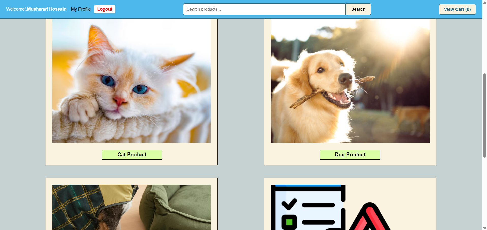
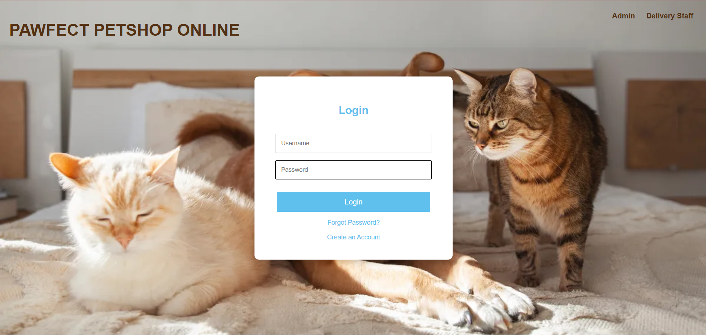
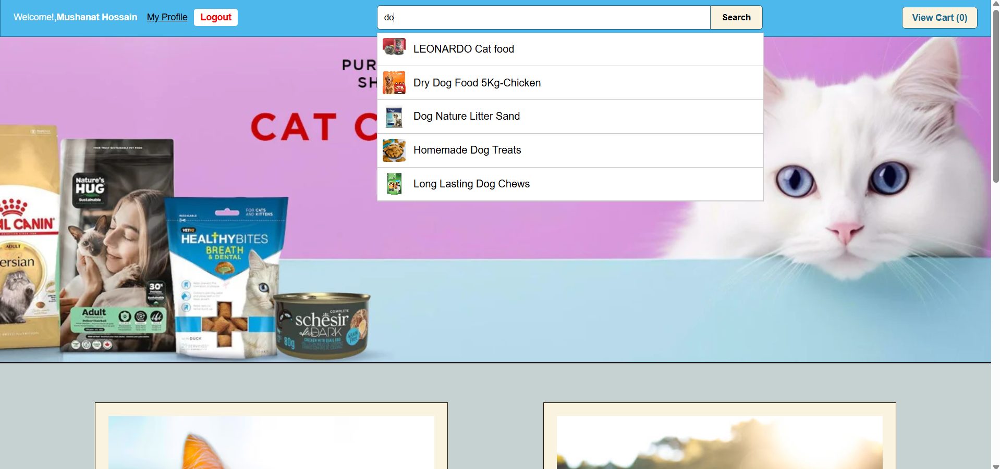
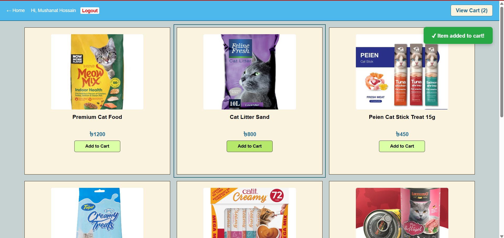
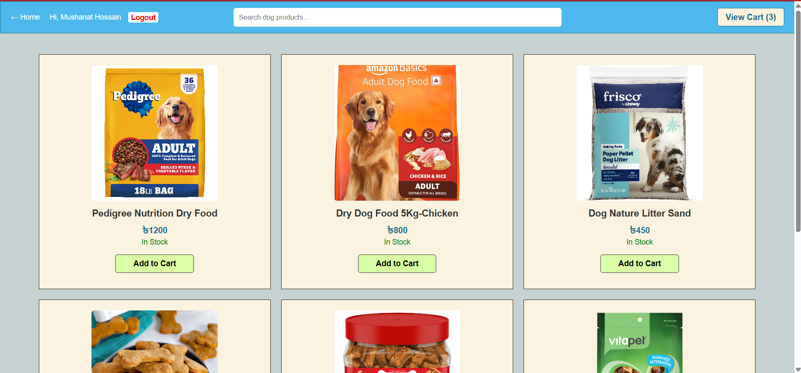
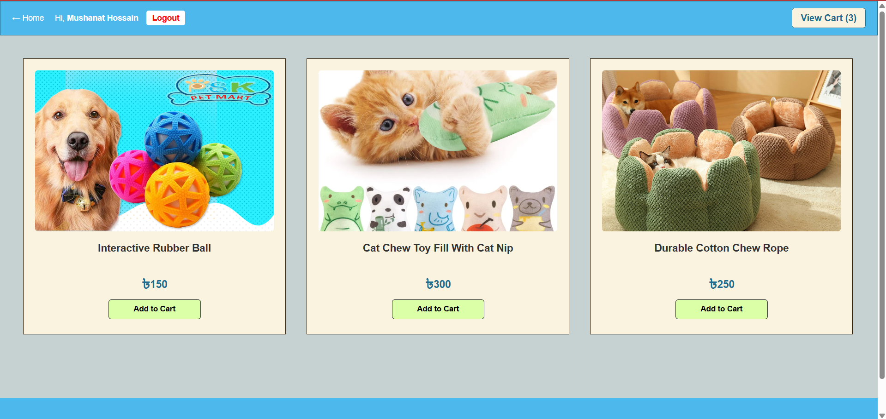
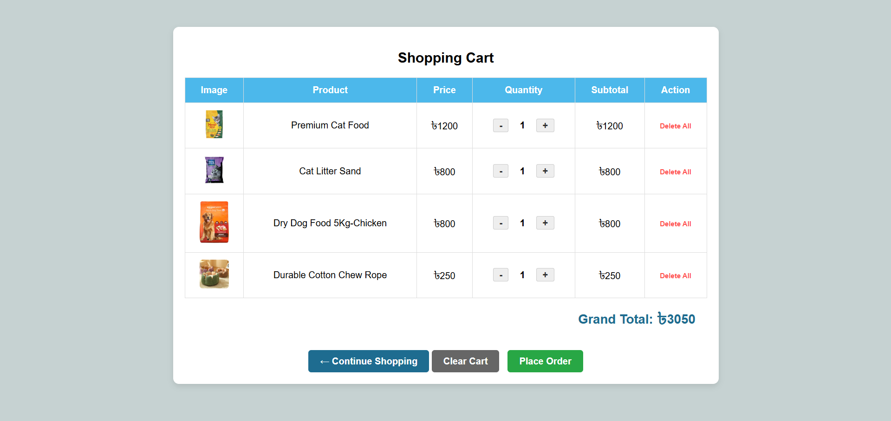
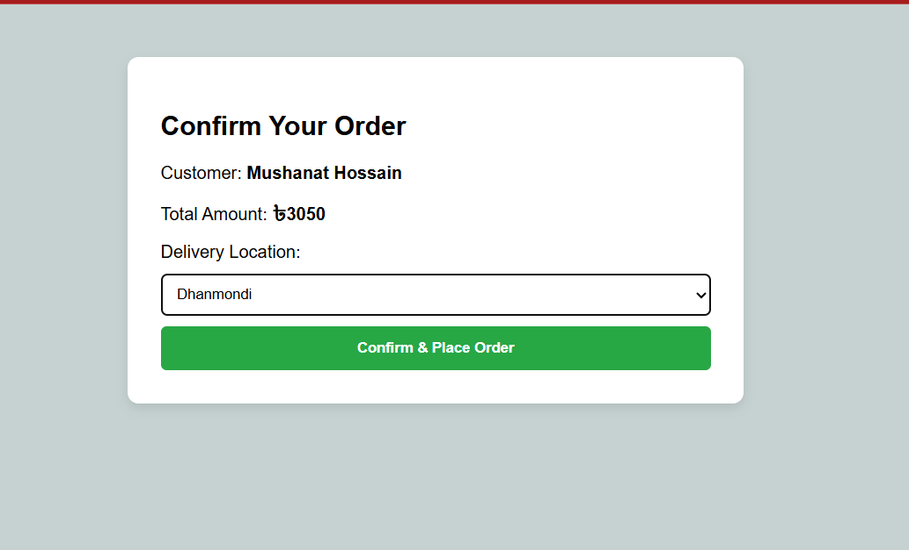
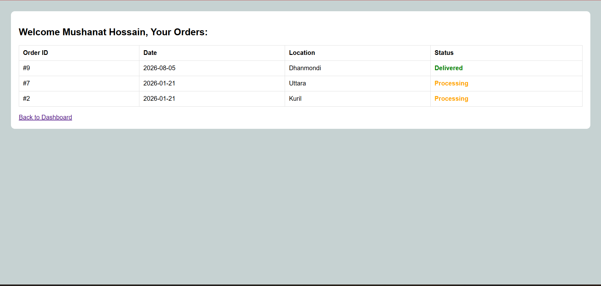
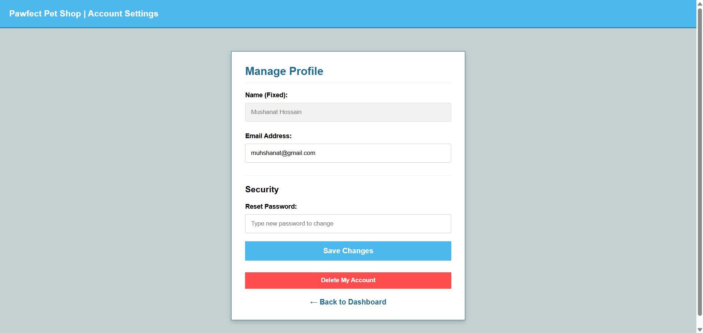

# 🐾 Pawfect Pals – Full-Stack Pet E-commerce Web Application

Pawfect Pals is a full-stack pet e-commerce web application that allows customers to purchase pet food, toys, accessories, and grooming supplies online. The platform provides role-based access for Admin, Customer, and Delivery Staff to ensure efficient product management, order processing, and delivery tracking.

---

## 📌 Features

### 👤 Customer (Muhshanat Hossain Tanjila)
- User registration and login
- Browse products by category
- Search products by keyword
- Add products to cart
- Place orders
- View order history
- Track delivery status
- Manage profile

 ## 📸 Customer Module Screenshots

| 🏠 Homepage | 🔐 Login |
|-------------|----------|
|  |  |

| 🔍 Search Products | 🛍️ Browse Products |
|--------------------|---------------------|
|  |  |

| 🐶 Dog Products | 🧸 Toy Products |
|----------------|-----------------|
|  |  |

| 🛒 Shopping Cart | 💳 Place Order |
|-----------------|----------------|
|  |  |

| 📦 Order History | 👤 Account Settings |
|------------------|---------------------|
|  |  |

### 🛠️ Admin (Tasnima Tabassum Sumaiya)
- Manage customers and delivery staff
- Manage products and inventory
- Monitor orders and deliveries
- Generate sales and inventory reports

### 🚚 Delivery Staff (Pulock Kundu)
- View assigned deliveries
- Update delivery status
- View delivery history
- Filter deliveries by date or location

---

## 💻 Tech Stack
- HTML5
- CSS
- AJAX
- JavaScript
- PHP
- MVC Architecture

### Database
- SQL Server

### Version Control
- Git
- GitHub

---

## 👥 Team Members

- Muhshanat Hossain Tanjila
- Tasnima Tabassum Sumaiya
- Pulock Kumar Kundu

